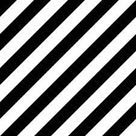
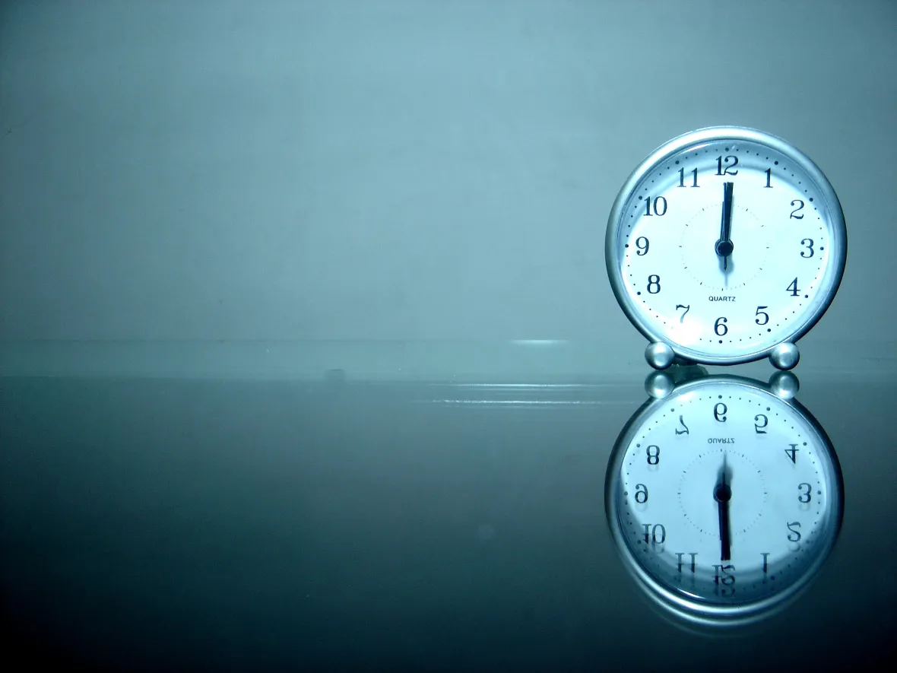
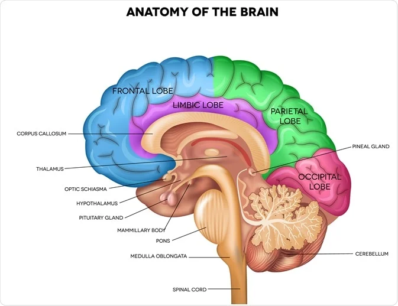

# 不可能通过的AIGC基准测试

这是一个任何都人都可以轻易检验的标准化测试，用于评估AIGC框架对复杂逻辑要求的服从性。一共10张图像，对应10个不同的挑战，用于评估AI理解复杂抽象指令并创建对应图案的能力。

一款AI必须全部通过所有十个挑战的每个调整，并且每个提示的图片良品率大于50%，才能算正式通过本测试。在挑战创办的2024年3月8日，为止还没有任何AIGC框架能通过了本测试。以及因为本校测试的难度，大概率需要AI在模型上有较大的变革才有可能真正通过。

接下来，是10个提示词，每道题提供一张已经通过测试的图片（来自互联网），对该项测试的要求，以及对于该测试难点的评估。

## Benchmark Images

### 五个口字组成的字

**Prompt:** An image of a Chinese character made up of five '口' characters.

**挑战内容:**
 这个挑战测试AI对汉字的理解，以及其操纵和排列特定元素以形成新字符的能力。AI通过测试的判定标准是：
 
1. 准确无误生成中文字，有五个“口”字，并且没有别的东西。
2. 生成的中文字，符合中文书写方式。

---

### 纯黑白均匀斜条纹

**Prompt:** An image of pure black and white uniform diagonal stripes.

**挑战内容:**
 这张图像测试AI严格遵循指令的精度。挑战在于保持条纹的宽度和角度一致，不发生任何偏差。AI通过测试的判定标准是：

1. 仅有纯黑色（#000000）和纯白色（#FFFFFF）
2. 有多哥条纹，所有黑色和白色条纹的宽度完全相同
3. 条纹的角度既不是0°也不是90°

---

### 冬天，倒立的雪人，雪人在微笑

**Prompt:** An upside-down snowman in a winter scene, with the snowman wearing a smile.

**挑战内容:**
这张图像测试AI对于物品在翻转这种异常逻辑下的绘制能力。AI通过测试的判定标准是：

1. 雪人应该有多于一个身体构造，其中头部应该在最底下。
2. 头部上的脸应该是倒立的，旋转180度时，应该是一个正确的笑脸。
3. 如果在雪人身上的围巾等元素，应该遵循地心引力。

### 黑板上用粉笔写的二次方程式

**Prompt:** An image showing the quadratic formula written in chalk on a blackboard.

**挑战内容:**
这个挑战评估AI准确记住并且表达数学公式的能力。AI需要记住解各种公式，并且能用手写粉笔风格呈现的能力。AI通过测试的判定标准是：

1. 准确无误显示二次方程式
2. 画面中公式是用粉笔手写在黑板上的

---

### 一张马骑人的照片

**Prompt:** Photo of a horse riding a man.

**挑战内容:**
这个挑战推动了AI的创造力和解释及执行超现实或想象概念的能力的边界。它测试AI对角色颠倒和这种情景的物理可行性的理解。AI通过测试的判定标准是：

1. 马和人都被准确无误地绘制
2. 马与人之间的关系应该是马骑在人身上。
3. 马和人的相对大小比例应该无误。

---

### 笔记本电脑键盘

**Prompt:** An image of a laptop keyboard.

**挑战内容:**
图像看似简单（互联网到处都是），但它测试了AI在复制有多个固定排布元素的准确性。挑战在于准确地描绘键盘的布局、间隔和设计，包括上面的任何符号和字母。AI通过测试的判定标准是：

1. 百分之百准确提供键盘的确切qwerty布局，没有任何错误
2. 图片呈现的是笔记本电脑的键盘

---

### 英文字母表，下方有所有阿拉伯数字，用草做的字体。

**Prompt:** An image showcasing the alphabet in a grass font style, with all ten numerals (0-9) displayed below in the same style.

**挑战内容:**
这个挑战测试AI准确无误地呈现大段文本以及用同样的材质进行渲染，在这个案例中，将字母和数字转化为草样的外观。它需要对排版的理解和以一致的方式应用自然纹理的能力。AI通过测试的判定标准是：

1. 准确无误地创建26个字母和数字，形状，顺序，排版完全正确
2. 逼真地模仿草的纹理
3. 每个字符应该可以作为字体使用

---

### 北斗七星图，用黄色线条连接白色的星星

**Prompt:** An image illustrating the Big Dipper constellation, where the white stars are connected by yellow lines.

**挑战内容:**
该挑战评估AI理解哪些抽象形状永远不应该修改的能力。它涉及准确记住形成北斗七星座的特定星星的准确形状，并用黄色线条正确连接它们。AI通过测试的判定标准是：

1. 准确无误描绘北斗七星和周边所有新星。
2. 准确无误用黄色线条连接正确的北斗七星。
3. 哪怕不是北斗七星里的星星，也不可以有错误的大小和位置。

---

### 时钟和它的镜像倒影

**Prompt:** An image of a clock and its reflection.

**挑战内容:**
该挑战评估对于真实世界的建模是否准确，尤其是对于图片中重复出现物品的逻辑关系是否正确。考虑到时钟的数字，指针的位置，会给AI建模时钟以及其反射倒影带来复杂性。AI通过测试的判定标准是：
1. 准确无误地渲染时钟
2. 准确无误地渲染时钟的反射，可以用实际的镜子检查。
3. 反射的时钟应该与原始时钟反射时的样子在画面一致。

---

### 带标注的大脑生理结构图

**Prompt:** A detailed anatomy diagram of the brain.

**挑战内容:**
这个挑战评估了AI生成准确解剖图和使用正确标签的能力。它需要准确记忆大脑的结构，包括各个区域及其功能。AI通过测试的判定标准是：
1. 准确无误地绘制出大脑的各个部分的形状、面积、位置关系。
2. 准确无误地标注大脑的每个不同部分。