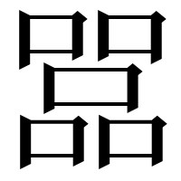
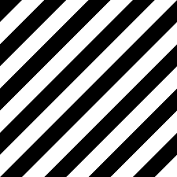
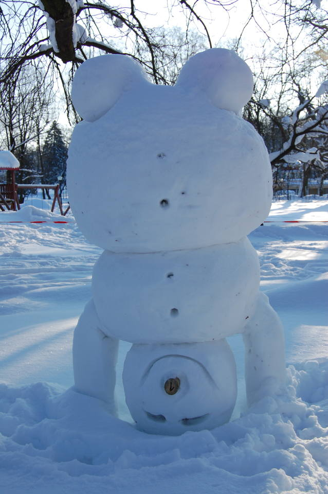
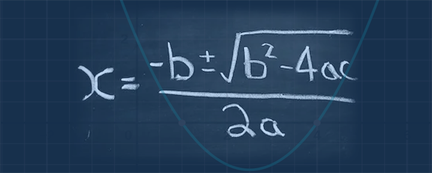
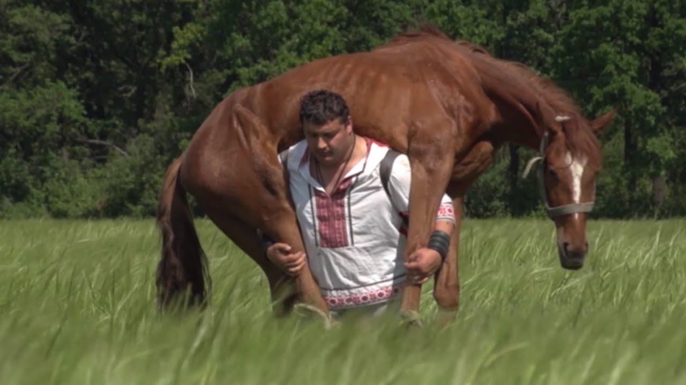
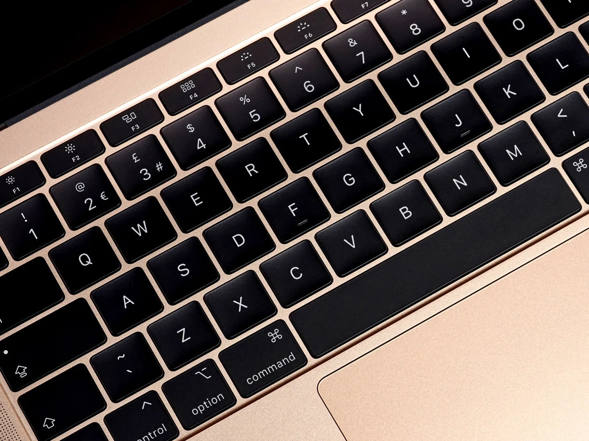
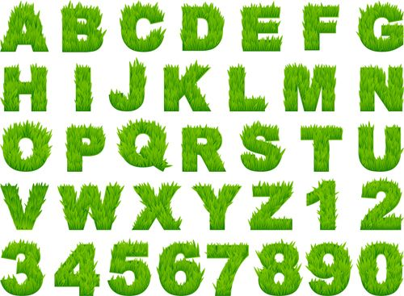
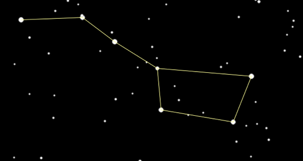
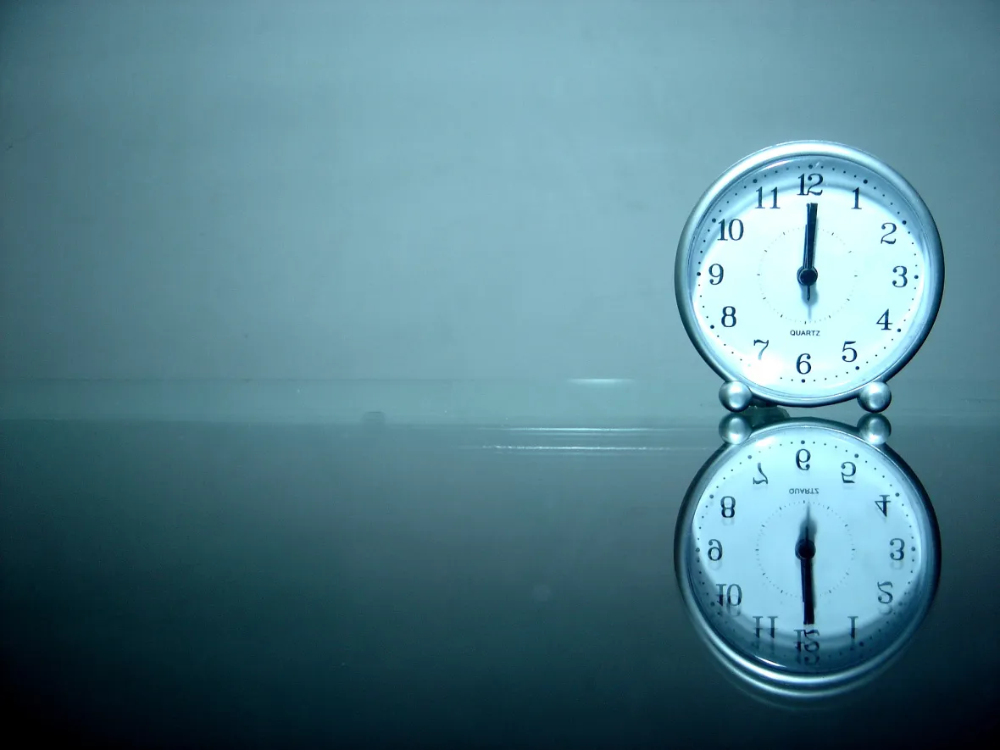
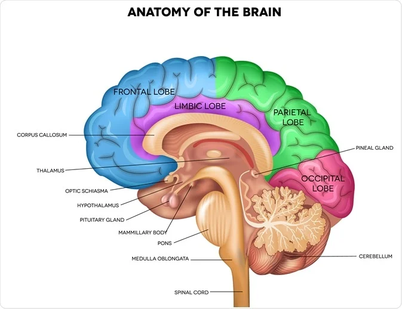

# Impossible AI Image Generation Benchmark

This repository hosts a benchmark for evaluating future AIGC's ability to create complex images. It consists of 10 images, each presenting a unique challenge to assess the AI's capability to interpret complex instructions and handle abstract concepts in image creation.

To pass this benchmark, an AI must be able to successfully pass all ten challenges with a pass rate of at least 50% for each prompt. As of the creation date of March 8, 2024, no AIGC framework has passed this test.

Below, you will find the benchmark prompts, alongside examples of passing images found on the Internet, and an explanation of the challenges each prompt poses to AI.

## Benchmark Images

### 五个口字组成的字

**Prompt:** An image of a Chinese character made up of five '口' characters.

**Challenge Explanation:**
This challenge tests an AI's understanding of Chinese characters and its ability to manipulate and arrange specific elements to form new characters. An AI would pass this test by accurately creating a coherent character that:
1. Has five '口' characters and nothing else
2. Is arranged in a way that fits Chinese handwriting.

---

### Pure Black and White Uniform Diagonal Stripes

**Prompt:** An image of pure black and white uniform diagonal stripes.

**Challenge Explanation:**
This image tests an AI's precision in strictly following directions. The challenge lies in maintaining consistent width and angle across the stripes, without any deviation. An AI passes this test by producing a pattern that:
1. Has only pure black (#000000) and pure white (#FFFFFF)
2. Has multiple stripes, the width of each stripe is exactly the same for each black and white stripe.
3. The angle of the stripes is not either 0° or 90°.

---

### Upside Down Snowman in Winter, The Snowman is Smiling

**Prompt:** An upside-down snowman in a winter scene, with the snowman wearing a smile.

**Challenge Explanation:**
This image poses a challenge due to the unconventional arrangement (upside-down) and understanding flipping the snowman while keeping facial expressions right. An AI passes this test by creating an image that:
1. The snowman should have more than one body part, the head part should be the lowest part.
2. The face on the head part should be upside-down, the face should be a smiling face when rotated 180 degrees.
3. If there are elements like a scarf that is on the snowman, it should follow the rules of gravity.

### Quadratic Formula in Chalk Written on Blackboard

**Prompt:** An image showing the quadratic formula written in chalk on a blackboard.

**Challenge Explanation:**
This challenge evaluates an AI's ability to accurately replicate mathematical notation and symbols in a realistic classroom setting. The task requires understanding of the specific formula, along with the ability to present it in a handwritten chalk style. An AI would pass this test by generating an image that:
1. Displays the quadratic formula exactly, without any kind of mistake.
2. It is handwritten in chalk on a blackboard.

---

### Photo of a Horse Riding a Man

**Prompt:** Photo of a horse riding a man.

**Challenge Explanation:**
This challenge pushes the boundaries of an AI's creativity and ability to interpret and execute surreal or imaginative concepts. It tests the AI's understanding of role reversal and the physical feasibility of such a scenario. An AI would pass this test by creating an image that:
1. There should be nothing wrong about the horse and the man, separately.
2. The relationship between the horse and the man should be the horse should be carried by the man. 
3. The relative sizes of the horse and man should be correct.

---

### Laptop Keyboard

**Prompt:** An image of a laptop keyboard.

**Challenge Explanation:**
This image might seem straightforward but it tests an AI's attention to detail in replicating everyday objects. The challenge lies in accurately portraying the layout, spacing, and design of the keys, including any symbols and letters on them. An AI passes this test by generating an image that:
1. Gives the exact qwerty layout of a keyboard without making any mistakes.
2. Is a laptop keyboard.

---

### Grass Font Alphabet with All Ten Numbers Below

**Prompt:** An image showcasing the alphabet in a grass font style, with all ten numerals (0-9) displayed below in the same style.

**Challenge Explanation:**
This challenge tests an AI's ability to creatively apply textures and themes to text, in this case, transforming letters and numbers into a grass-like appearance. It requires an understanding of typography and the application of a natural texture in a consistent manner. An AI would pass this test by:
1. Accurately creating a visually coherent set of alphabets and numbers that are in the correct order, without making any mistakes at all.
2. Convincingly mimic the texture of grass.
3. Each character should be usable as a font.

---

### Diagram of The Big Dipper, Connect White Stars with Yellow Lines

**Prompt:** An image illustrating the Big Dipper constellation, where the white stars are connected by yellow lines.

**Challenge Explanation:**
This challenge evaluates an AI's ability to understand which abstract shapes should never be modified. It involves accurately remembering the exact shape of the specific stars that form the Big Dipper constellation and connecting them correctly with yellow lines. An AI passes this test by generating an image that:
1. Correctly identifies and depicts the stars in a way that accurately represents the constellation's shape
2. Connect the right stars with yellow lines 
3. Doesn't have wrong stars in the picture.

---

### Clock and Its Reflection

**Prompt:** An image of a clock and its reflection.

**Challenge Explanation:**
This image tests the AI's understanding of how abstract objects would reflect in real life. The complexity arises in accurately mirroring the clock, considering aspects such of the arrangement of reflected numbers and the position of the reflected needles. An AI would pass this test by creating an image where:
1. The clock is accurate
2. The reflected clock is accurate when looked into a mirror
3. The reflected clock should be exactly the same clock as the original clock when reflected.

---

### Anatomy Diagram of the Brain

**Prompt:** A detailed anatomy diagram of the brain.

**Challenge Explanation:**
This challenge assesses an AI's capability to generate accurate anatomical illustrations and use correct labeling. It requires accurate memorization of the brain's structure, including various regions and their functions. An AI passes this test by producing an image that is:
1. Scientifically accurate in shape, area, positional relationship
2. Accurate in labeling each different part of the brain

----

Simplified Chinese Version(简体中文版)：[README-zhcn.md]
